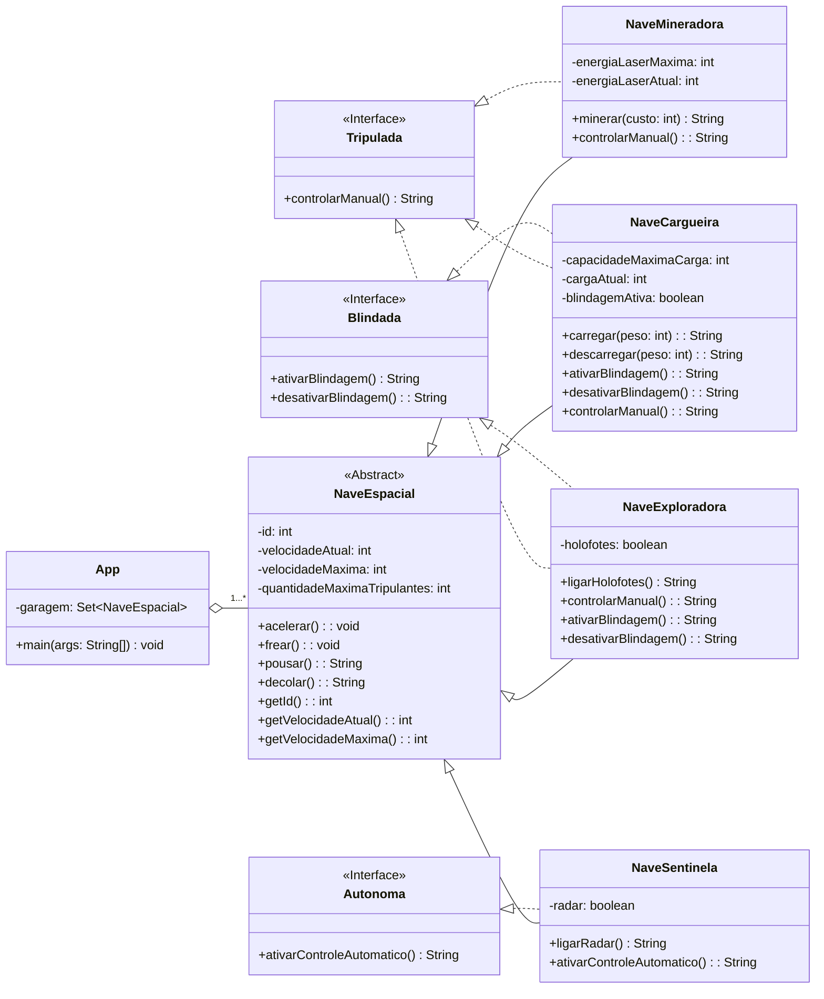

### Lista 4

O projeto representa uma frota espacial formada por vários tipos de naves, cada uma com características, comportamentos e limitações próprias conforme as regras definidas no enunciado da lista.

Usamos orientação a objetos para modelar herança, interfaces e polimorfismo.

Criamos a classe abstrata NaveEspacial porque define um conjunto de atributos e métodos comuns a todas as naves. 

As interfaces Tripulada, Blindada e Autonoma representam capacidades opcionais. Cada nave implementa as interfaces que fazem sentido para sua função.

### Diagrama UML 

O diagrama foi feito usando sintaxe Mermaid, e reflete exatamente o que foi implementado no código. Ele mostra as classes, métodos, atributos e interfaces de forma organizada.

