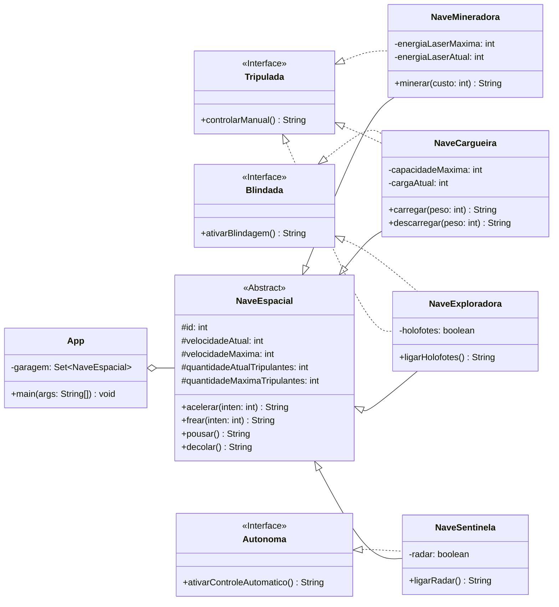

```mermaid
classDiagram
    direction LR

    class App {
        -garagem: Set~NaveEspacial~
        +main(args: String[]) void
    }

    class NaveEspacial {
        <<Abstract>>
        #id: int
        #velocidadeAtual: int
        #velocidadeMaxima: int
        #quantidadeAtualTripulantes: int
        #quantidadeMaximaTripulantes: int
        +acelerar(inten: int) String
        +frear(inten: int) String
        +pousar() String
        +decolar() String
    }

    class Tripulada {
        <<Interface>>
        +controlarManual() String
    }

    class Blindada {
        <<Interface>>
        +ativarBlindagem() String
    }

    class Autonoma {
        <<Interface>>
        +ativarControleAutomatico() String
    }

    class NaveCargueira {
        -capacidadeMaxima: int
        -cargaAtual: int
        +carregar(peso: int) String
        +descarregar(peso: int) String
    }

    class NaveMineradora {
        -energiaLaserMaxima: int
        -energiaLaserAtual: int
        +minerar(custo: int) String
    }

    class NaveExploradora {
        -holofotes: boolean
        +ligarHolofotes() String
    }

    class NaveSentinela {
        -radar: boolean
        +ligarRadar() String
    }

    %% Relacionamentos de Herança
    NaveEspacial <|-- NaveCargueira
    NaveEspacial <|-- NaveMineradora
    NaveEspacial <|-- NaveExploradora
    NaveEspacial <|-- NaveSentinela

    %% Relacionamentos de Implementação de Interface
    Tripulada <|.. NaveCargueira
    Blindada <|.. NaveCargueira
    Tripulada <|.. NaveMineradora
    Tripulada <|.. NaveExploradora
    Blindada <|.. NaveExploradora
    Autonoma <|.. NaveSentinela

    %% Relacionamento da App
    App o-- NaveEspacial

```